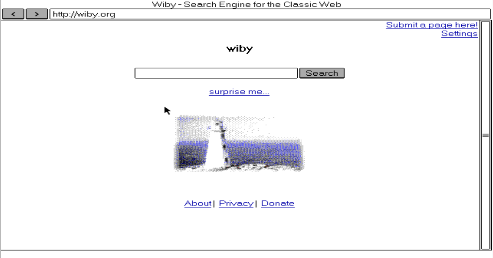
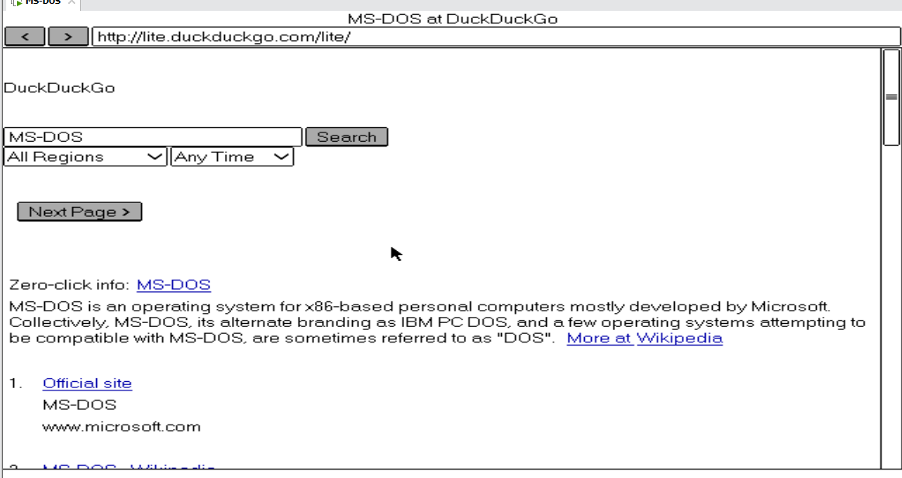
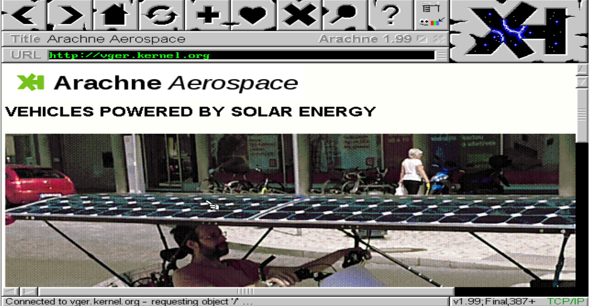
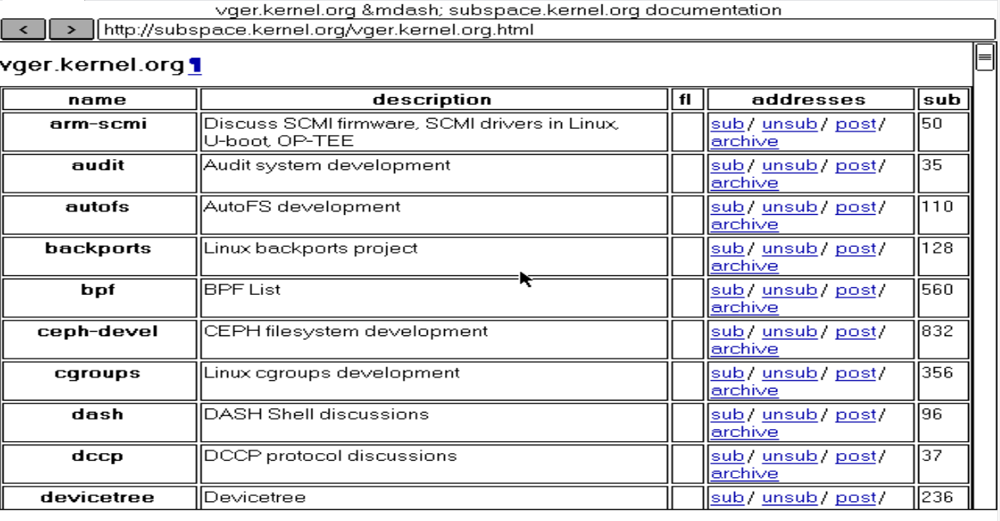
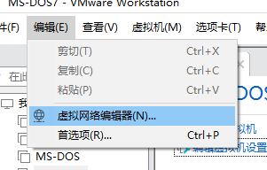
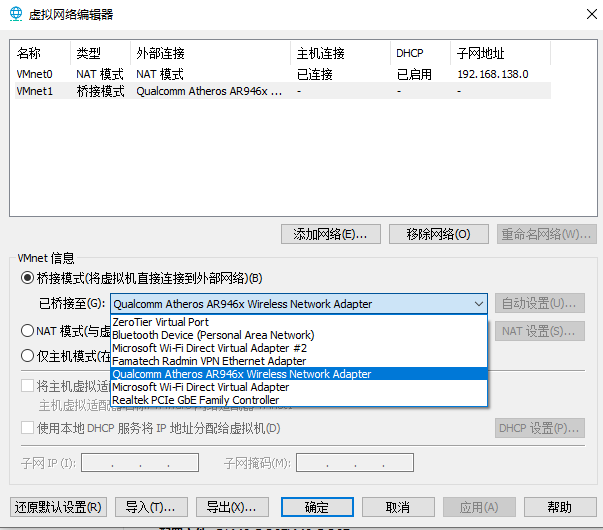
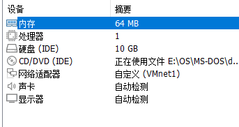
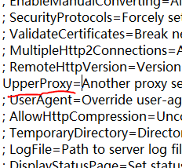

## VMware 环境下MS-DOS7 网络栈构建与现代Web接入

#### 1.项目概述

本项目旨在实现在现代虚拟机环境中（VMware）中，为MS-DOS7.1构建可用的TCP/IP网络协议栈，并实现对现代互联网（HTTP/部分HTTPS）的受限访问。

本项目解决了部分在16位系统在现代网络环境下常见的驱动冲突，HTTPS握手失败，浏览器启动卡死等问题。

受限于DOS操作系统的内存管理和硬件，JS等现代技术在DOS7.1上未能成功支持。


运行截图






通过代理访问https页面

e.g: https://vger.kernel.org/

无代理状态，不支持https



（长时间卡顿后报错）


代理后访问成功



#### 2.实验环境

- 宿主机：推荐Windows10及以上，需安装代理服务端[webone](https://github.com/atauenis/webone)，具体操作见webone详情页
- 虚拟机软件：VMware WorkStation，访问官网安装
- 操作系统：MS-DOS7.1 [Download](https://winworldpc.com/product/ms-dos/7x)

#### 3.安装虚拟机

- 更改网卡

   	

​	选择虚拟网络编辑器，选择更改设置，添加一张桥接网卡。



​	根据网络环境选择桥接网卡，我处于WIFI环境，选择WIFI卡。创建好后启用该适配器。

​   	


​	其余设置大致相同即可，内存不要超过128M，可能导致系统不稳定。

- 安装过程可参考 [此链接](https://github.com/cbuntu/wintutorial/blob/master/install/msdos7.md)

#### 4.添加联网文件

- 使用[UltralSO](https://www.ultraiso.com/)或其它同类软件制作iso，将文件存入虚拟光盘中并挂载

- 本文中所有操作均使用Release中的iso完成

- 盘符一般为A：

- 拷贝至系统中

  e.g.

  ```bat
  C:\>A:
  A:\>DIR
  A:\>MD C:\DRIVERS
  A:\>MD C:\MTCP
  A:\>MD C:\MICROWEB
  A:\>MD C:\ZHCN
  A:\>COPY PKUNZIP.EXE C:\DOS71
  A:\>COPY PCNTPK.COM C:\DRIVERS
  A:\>COPY A199GPL.EXE C:\
  A:\>COPY *.ZIP C:\TEMP
  A:\>C:
  C:\>CD TEMP
  C:\TEMP>PKUNZIP -D MTCP.ZIP C:\MTCP
  C:\TEMP>PKUNZIP -D MICROWEB.ZIP C:\MICROWEB
  C:\TEMP>PKUNZIP -D TW.ZIP C:\ZHCN
  C:\TEMP>CD \
  C:\>EDIT AUTOEXEC.BAT
  ```

  编辑AUTOEXEC.BAT

  ```bat
  SET PATH=C:\MTCP
  SET MTCPCFG=C:\MTCP\MTCP.CFG
  @ECHO OFF
  ```

  ```BAT
  LH DOSLFN /Z:C:\DOS\CP437UNI.TBL
  LH C:\DIVERS\PCNTPK.COM INT=0x60
  REM LH MSCDEX /D:IDE-CD #可选择不REM注释掉CD驱动
  ```

  ```bat
  DHCP
  ECHO Now you are in MS-DOS 7.10 prompt. Type 'HELP' for help.
  ECHO.
  ```

  退出编辑模式

  ```bat
  C:\DELTREE C:\TEMP\
  ```

  删除压缩包后，重启虚拟机。

  - 测试

  ```bat
  ping baidu.com
  ```

  若获得回应，联网配置完成。

  #### 5.浏览器配置

  - Arachne

  Arachne浏览器无法设置https代理，但对图片支持比较强大。

  ```bat
  A199GPL.EXE
  ```

  即可启动安装程序。注意，尽量将此文件置于C盘根目录。

  配置网络选择网卡一路点击Next，选择Packet Wizcard，然后继续一路点击Next，程序将自动获取网络。

  退出后

  ```bat
  CD \
  DELTREE A199GPL.EXE
  ```

  删除安装文件

  - MicroWeb

  MicroWeb可与宿主机配合，较好的浏览http网页。

  输入

  ```bat
  CD C:\MICROWEB
  START
  ```

  即可启动。若想要其它主页形式，更改STARTP.HTM即可

  ```htm
  <!DOCTYPE html>
  <html>
  <head>
    <title>Start Page</title>  #页面标签
  </head>
  <body>
    <div class="link list">
       <h1>Any Good Web</h1>   #题头
       <ul>                           #链接，数量随意
         <li class="link-item"><a href="What you want">You Want</a></li> 
       </ul>
    </div>
    <hr>
    <p>Press Esc To Quit.</p>  #底部文本
  </body>
  </html>
  ```

  然后，根据宿主机IP，修改START.BAT。

  ```bat
  CD C:\MICROWEB
  EDIT START.BAT
  ```

  ```BAT
  SET HTTP_PROXY=IP:8080
  ```

  此时仍不可浏览网页。

  #### 6.宿主机配置

  - 安装代理服务端[webone](https://github.com/atauenis/webone)

  根据详情页指导，应当出现此界面

  

  此时，再次运行MicroWeb，就可以访问https网络了。

  - 代理需求

  若需要在DOS中访问宿主机需连接代理才可访问的网址，需要找到宿主机使用的代理的端口号

  例如，宿主机依靠7890端口的代理访问网站A，现在想要在DOS中访问网站A。

  只需要打开webone.conf

  

  取消注释UpperProxy并正确填写（IP:PORT)即可。

  #### 7.对程序的更改

  本项目未对程序本体做任何修改。
  本项目所有文件均为原版。所有修改存于Release中的ISO镜像中。
  - ISO镜像更改：
  - 去除了ARACHNE 1.99GPL的编译包ASRC199.ZIP，仅保留安装文件exe
  - 增加了MicroWeb的启动脚本start.bat，自动配置代理，自动打开本地文件防止卡死
  - 去除了MTCP除exe外所有文件，编写了适用于本教程的MTCP.cfg


  #### 8.项目局限
  本项目仍然无法解决DOS系统下的中文显示问题，且不支持IPX。


  #### 9.本项目所有文件来源于网络，且已给出链接，仅可作为个人交流学习使用。若发现本项目侵犯了您的权力，请联系3636230447@qq.com，以便删除处理。

  MS-DOS系统镜像来源：https://winworldpc.com/product/ms-dos/7x

  PCNTPK来源：https://www.brutman.com/Device_Drivers/Device_Driver_Collection.html

  Arachne浏览器来源：https://www.glennmcc.org/arachne

  MTCP来源：https://www.brutman.com/mTCP/mTCP.html

  天汇汉字系统来源：http://upload.cn-dos.net/img/127.rar
